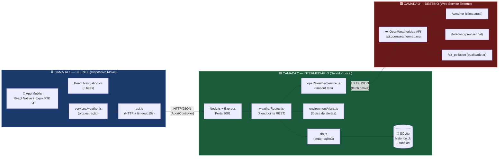
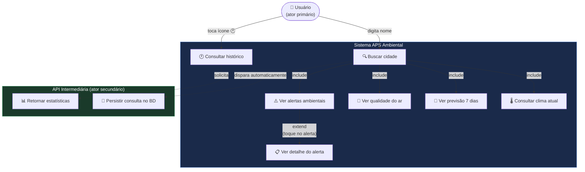
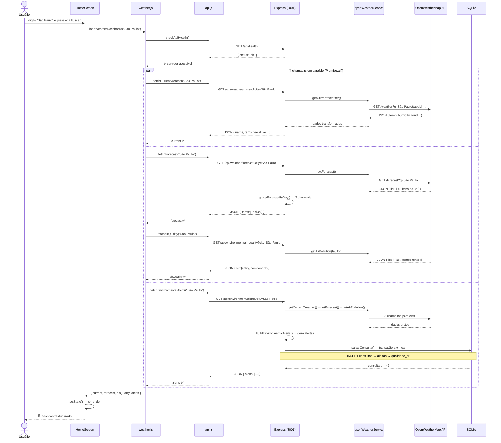
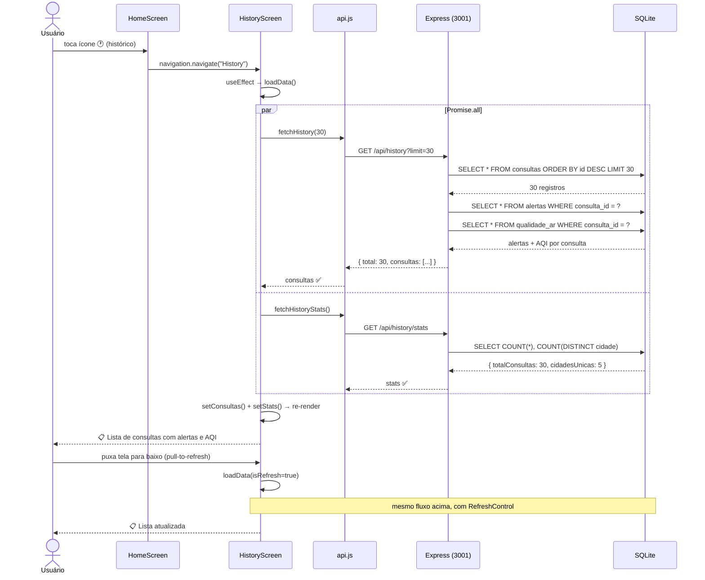
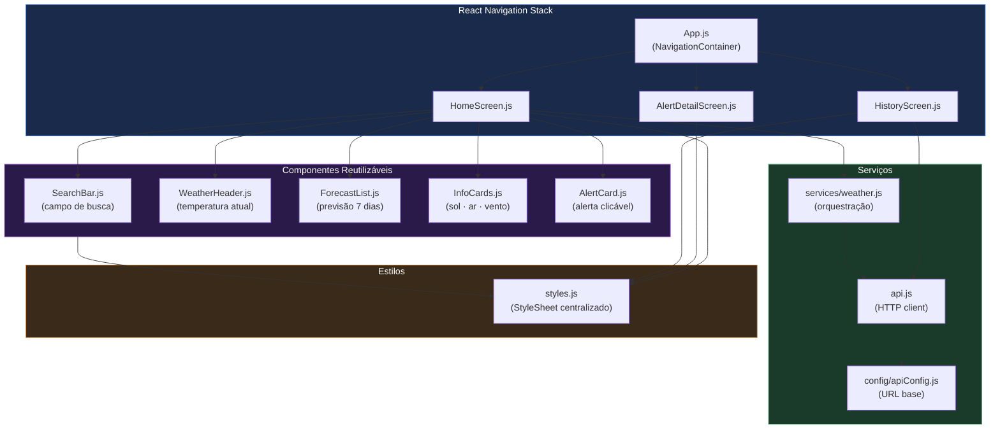
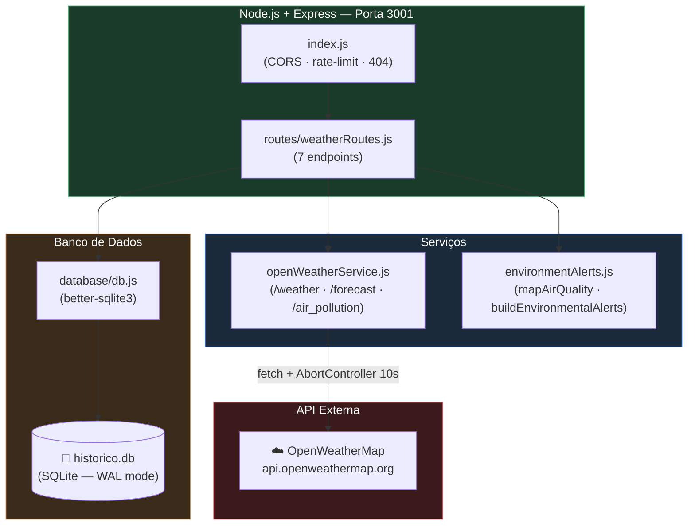
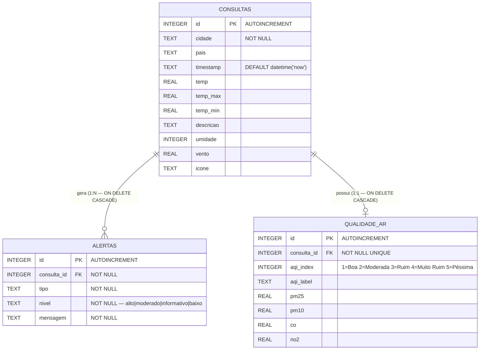
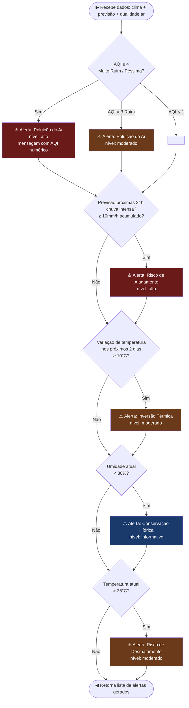
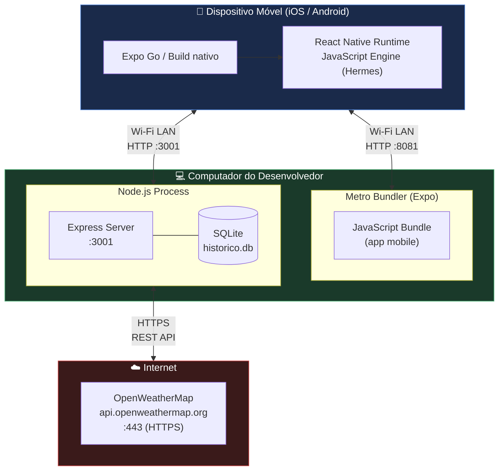

# Diagramas UML — APS Ambiental
**UNIP · Ciência da Computação · Desenvolvimento de Sistemas Distribuídos**

> Como visualizar: abra este arquivo no VS Code com a extensão
> **"Markdown Preview Mermaid Support"** e pressione `Ctrl+Shift+V`.
> Ou cole cada bloco em **[mermaid.live](https://mermaid.live)** para exportar PNG/SVG.

---

## 1. Diagrama de Arquitetura — Sistema Distribuído em 3 Camadas



---

## 2. Diagrama de Casos de Uso



---

## 3. Diagrama de Sequência — Fluxo de Busca de Cidade



---

## 4. Diagrama de Sequência — Fluxo de Histórico



---

## 5. Diagrama de Componentes — Mobile (React Native)



---

## 6. Diagrama de Componentes — Servidor (Node.js)



---

## 7. Diagrama Entidade-Relacionamento — Banco de Dados SQLite



---

## 8. Diagrama de Atividades — Geração de Alertas Ambientais



---

## 9. Diagrama de Implantação (Deployment)



---

## Como exportar para o trabalho acadêmico

1. Acesse **[mermaid.live](https://mermaid.live)**
2. Cole o código de cada diagrama (bloco entre ` ```mermaid ` e ` ``` `)
3. Clique em **"Download SVG"** ou **"Download PNG"**
4. Insira as imagens no documento APS (Word/PDF)

> **Dica:** No VS Code, instale a extensão
> [Markdown Preview Mermaid Support](https://marketplace.visualstudio.com/items?itemName=bierner.markdown-mermaid)
> para visualizar sem sair do editor.
